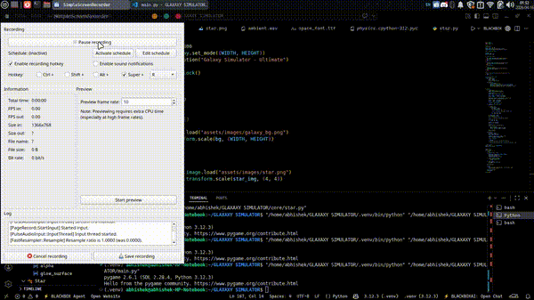

# 🌌 Galaxy Simulator — N-Body Physics Engine

A real-time galaxy simulation built using **Python + Pygame**, modeling gravitational interactions between stars to generate a **spiral galaxy structure**.

> ⚡ This project demonstrates the fundamentals of computational astrophysics through an interactive visual simulation.

---

## 🚀 Features

* 🌌 Spiral galaxy formation
* 🕳️ Central black hole with glowing core
* ⭐ Star-to-star gravitational interaction
* 🔁 Stable orbital motion
* 🎨 Dynamic star brightness & size
* 🌠 Trail-based motion visualization
* 🎧 Optional background, sound & UI assets

---

## 🧠 Physics & Concepts

This simulation is based on real scientific principles:

* **Newton’s Law of Gravitation**
* **N-body Simulation**
* **Orbital Mechanics**
* **Angular Momentum Conservation**
* **Density Wave Theory (Spiral Arms)**

---

## 📸 Preview

> A dynamically evolving spiral galaxy with realistic motion and structure.



---

## ▶️ Run the Project

```bash
pip install -r requirements.txt
python main.py
```

---

## 📁 Project Structure

```
galaxy-simulator/
│
├── main.py
├── config.py
│
├── core/
│   ├── star.py
│   ├── blackhole.py
│   ├── physics.py
│
├── utils/
│   ├── helpers.py
│
├── assets/
│   ├── images/
│   ├── sounds/
│   ├── fonts/
│
├── requirements.txt
└── README.md
```

---

## 🎨 Assets (Optional)

The simulator supports optional assets for enhanced visuals:

* `assets/images/galaxy_bg.png` → background
* `assets/images/star.png` → star texture
* `assets/sounds/ambient.wav` → background sound
* `assets/fonts/space_font.ttf` → UI font

> ⚠️ If assets are missing, the simulation still runs normally.

---

## 🔥 Future Improvements

* 💥 Galaxy collision simulation
* 🌌 Dark matter halo modeling
* 🌐 Web-based version (Three.js)
* 📊 Real-time data visualization
* 🎮 Interactive controls (zoom, speed, gravity)

---

## 🧑‍💻 Author

**Abhishek**
Aspiring Astrophysicist 🚀

---

## ⭐ Show Your Support

If you found this project interesting:

* ⭐ Star this repo
* 🍴 Fork it
* 📢 Share it

---

## 💬 Inspiration

Inspired by real simulations used in astrophysics research to study galaxy formation and dynamics.

---

## 🚀 Final Note

This project is not just a visualization —
it’s a step into **computational astrophysics and simulation science**.
